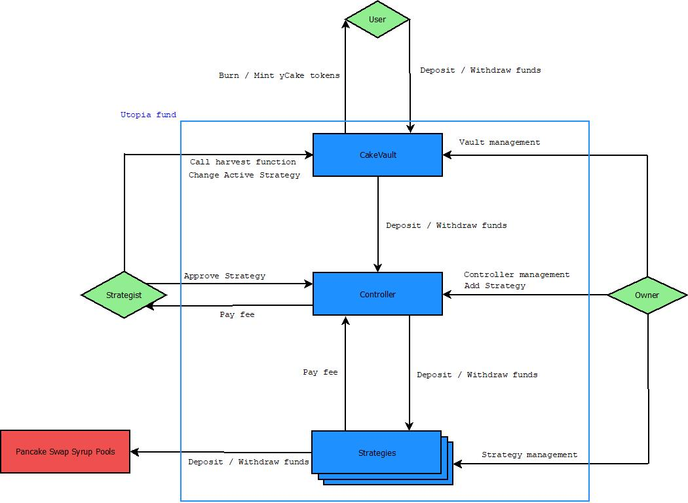

# Utopia fund
Utopia fund is a yield aggregator for PancakeSwap's syrup pools


### How to use
Before a deposit you have to call the Cake token's approve function. The spender is the Vault address and the amount should be higher than the amount you would like to deposit. After this the deposit function is usable. It's important to keep the received yCake tokens because you will need them to withdraw the deposited amount.

The getPendingReward function returns the accumulated profit for the user.
**This value is only updated after a harvest**

Before a withdraw, similarly to the deposit, you have to call an approve, but this time is for the yCake tokens. Just like before, the spender is the Vault address and the amount should be at least equal to the amount of Cake tokens you would like to withdraw. This doesn't include the received profit.

The userHarvest function sends out the pending reward and sets it to zero. There's no need for approve or burning yCake tokens.

### Development
Things you need:
- [Node.js](https://nodejs.org/)
- Truffle

After downloading the source code you have to download the dependecies as well. For this, open a command line in the project folder and run the following command.
```sh
npm install
```
This will download every necessary files in the node_modules folder.

You need two wallets for testing and deployment, an Owner and a Strategist. The Owner is responsible for the deployment and supervises the application. The Strategist is responsible for the efficient profit gaining. The Strategist and the Owner should be separate entities for safety reasons. 

The core of the project is made up of 3 smart contracts. The Controller, the Vault and the Strategy. There's also a script file wich helps the Staretgist choose the most profitable pool.
- There sould always be only one instance of the Controller and it links all the Strategies to the Vault
- There can be more than one Vault but each Vault can only use one type of token as a base.
- Every Strategy is representing a separate pool so there can be more than one linked to a Vault, but only one of them can be active. The Strategist decides wich Strategy is active.

When changing Strategy, every token will be relocated to the new active Strategy. We are planning to make a system where can be more than one active Strategy and the assets are distributed evenly amongst them.

Before deployment you need to create a .secret file in the project folder and copy the 12 word long MetaMask safety key in there and nothing else. Make sure to not share that file anywhere because it can endanger your wallet and your savings.

Before deploying on the Mainnet, in the truffle-config.js file, change the "from:" address in the "bsc:{}" to the one you would like to use as Owner. This address will deploy the contracts so make sure you have enough gas.

The deployment of contracts is done through the 2_deploy_contracts.js file. You have to specify here wich contracts you would like to deploy and in what order. Also this is where you pass values to the constructors.

Deployment can be done by either of these commands.
Mainnet
```sh
truffle deploy --network bsc
```
Testnet
```sh
truffle deploy --network testnet
```
If you get the "Network is up to date" message, write `--reset` at the end of the command.

After deployment, the Vault and at least one Strategy has to be added to the Controller. This is done by the Owner. After that you need to approve all the Strategies you just added. This is done by the Strategist. If you have at least one Strategy linked to a Vault, call the changeStrategy function from the Vault with a linked Strategy address at least once. After you've done that that application is ready to be used.

For the script to work as intended you need to edit the app/src/crypto_helper.js file by adding the correct key-value pairs to the maps. You also need to have a collection representing every pool in the index.js file's "pools" variable. This will be implemented with a database in the future.